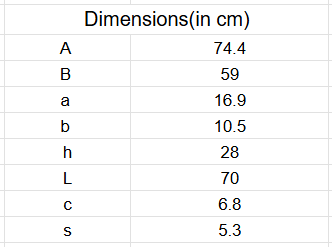

# Lumos!

# Mapping the Milky Way using 21 cm HI line emission

Welcome to the GitHub repository for our **Bachelor’s project** at [IIT Delhi](https://home.iitd.ac.in/). Under the guidance of [Professor Suprit Singh](https://supritsinghlab.github.io/cv/), this project aims to derive the **Rotation curve** and **map the spiral arms of the Milky Way Galaxy** using data from galactic neutral hydrogen (HI) emissions conducted over the course of a single semester. This data is obtained using a **pyramidal horn antenna**, tuned to observe 21 cm (1420.4 MHz) emission from interstellar HI clouds concentrated in the galaxy's spiral arms, and processed to infer spatial and kinematic properties of the Milky Way.

## Table of Contents 

## Experimental Setup
The experimental setup involves the following signal flow:
1. **Horn Antenna**: The process begins with the pyramidal horn antenna, which captures the 21-cm hydrogen line signals emitted from the HI clouds.
2. **Low-Noise Amplifier (LNA)**: The received signal is directed to a low-noise amplifier equipped with an inbuilt band-pass filter. The LNA amplifies the weak signals and suppresses components outside the allowed band.
3. **Software-Defined Radio (SDR)**: The amplified signal is fed into a software-defined radio, which digitizes the analog signal for further processing.
4. **Computer / Raspberry Pi**: The processed data is transferred to a computer or Raspberry Pi for further analysis and storage. Here, H-line software extracts data from the RTL-SDR, converts it to an SNR vs. frequency curve, and applies smoothing and corrections for linear trends.

Experimental Setup

## Design of the Horn Antenna

### Why Use a Pyramidal Horn Antenna?
The pyramidal horn antenna was chosen for this project due to its:
- **Ease of Construction**: Simple geometry makes it straightforward to design and fabricate.
- **Cost-Effectiveness**: Requires fewer and inexpensive resources - MDF board, aluminium foil(kitchen foil) and aluminium tape. 
- **Better Directivity**: Horn antennas provide good directivity, making them ideal for capturing signals from specific sky regions.

### How to Select Dimensions of a Horn Antenna
The [electrodynamics](Theory/Electrodynamics_PyramidalHorn.pdf) of the pyramidal horn antenna is analyzed using concepts from Antenna Theory by Constantine A. Balanis. For a detailed explanation, including the procedure to optimize the antenna's directivity, refer to the section Design Procedure in the 13th chapter on Horn Antennas. The corresponding Python [code]((./path/to/horn_antenna_design.pdf)) with the iterative algorithm used to determine the aperture lengths is also given.

|  |  |
|:---:|:---:|

Antenna Magus is utilized for simulating the radiation pattern, and the aperture dimensions determined through the iterative method show excellent agreement with the software's results. An 18 dB gain is chosen to ensure that the dimensions of the horn antenna remain manageable (less than 1 meter in total length). Combined with the additional 40 dB gain provided by the LNA, this setup is expected to be sufficient for capturing the weak signals effectively.

|  |  |
|:---:|:---:|
| 3D representation of Radiation pattern | 2D representation of Radiation pattern and Beam width ~ 20&deg;|

[Simulated S-parameters](images/S-parameters.png) for the above-mentioned dimensions of the horn and waveguide.

The [DSPIRA](https://wvurail.org/dspira-lessons/) project is an excellent resource for building the antenna stand ([ours](images/stand.jpg)) and utilizing GNU Radio as an alternative to H-line software (for amateurs, it is recommended to use the latter).

## Observation Procedure 

### H-line software 
We used the [H-line software](https://github.com/byggemandboesen/H-line-software/tree/main) by byggemandboesen for extracting data from the RTL-SDR. It also converts it into an SNR vs. frequency curve, and performs tasks such as smoothing and correcting for linear trends.

The following GIF consists 8 observations across the galactic plane at approximately 10~15 degree intervals.

### Altitude and Azimuth pointing
To align the horn antenna with the galactic plane, we utilized the Stellarium Mobile application to identify celestial objects within the galactic plane at regular intervals. Their corresponding Alt/Az coordinates, provided by the application, were used as reference points. The antenna was then oriented using the Satfinder application in AR mode to match these coordinates.

Note: Care was taken to minimize interference when using Satfinder, ensuring that the device was kept away from metallic objects (e.g., the waveguide) and the ground. In our setup, the handle at the front of the cradle was used as a reference point for precise alignment, although the horn antenna's beamwidth provides some margin for error in positioning.

## Acknowledgments
This project was presented to an audience of over **3,000 high school students**, fostering interest in astronomy and space science. The event received **national media coverage**, showcasing the importance of science outreach.

I am deeply grateful to **Professor Suprit Singh** for his invaluable guidance and mentorship. His expertise in cosmology and theoretical astrophysics was instrumental in shaping the project and ensuring its success.

---

This repository contains:
- **Code**: Scripts for data processing and mapping.
- **Data**: Observational and processed data from the project.
- **Documentation**: Step-by-step guide to reproduce results and understand the methodology.

Feel free to explore, use, and contribute to this project. Let’s unravel the mysteries of our galaxy together!

## License
This project is licensed under [MIT License](LICENSE).

